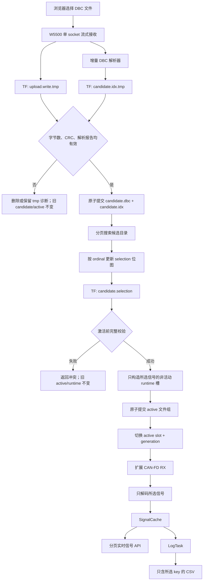

# 大文件 DBC 上传、信号筛选与选择性记录实施方案

文档状态：`历史规划基线；已由 docs/LARGE_DBC_P0_CONTRACT.md 和阶段17 A0-D实施状态取代`

版本：`v0.1`

日期：`2026-07-27`

适用仓库：`/Users/elvin/Desktop/project/can_bus_W5500`

适用分支基线：`codex/W5500`

历史示例输入：`/Users/elvin/Desktop/project/data/BNE_DEV_1Fx_EVE_I420_I210_V1.0.dbc`

当前验收输入以`docs/LARGE_DBC_P0_CONTRACT.md`冻结的
`BNE_CLASSIC_CAN_TEST_100KB.dbc`为准；本文件保留用于追溯编码前方案，不能作为
当前Classic CAN实现状态或CAN-FD实板通过证据。

---

## 1. 文档目的

本文定义以下需求的实现边界、数据合同、阶段任务、成功标准、验证证据和禁止范围，供编码前审核：

1. 从网页上传大于当前 1024 B 上限的 DBC 文件。
2. 在 STM32H750 + W5500 + TF 卡平台上读取并解析大文件 DBC。
3. 在网页中搜索 DBC 信号。
4. 对上传后的信号执行“保留/移除”选择。
5. 只让保留信号进入活动运行态、实时信号页面和 CSV 记录。
6. 信号区域固定高度、内部滚动，避免整页被数百个信号拉长。
7. 保持当前 W5500 单 socket、TF 事务保存、活动 DBC 双槽切换和失败回滚原则。

本文是实施方案，不表示功能已经实现或验证。

---

## 审核导航

建议按以下顺序审核：

1. 先审核第 2 节的 12 项核心决定。
2. 再审核第 5 节的“逻辑移除”语义是否符合产品预期。
3. 审核第 7、8、9、10 节的数据文件和 API 合同。
4. 审核第 11 至 15 节对运行态、CAN-FD、日志和网页的影响。
5. 审核第 16 节阶段划分及每阶段禁止范围。
6. 最后使用第 17、18、19、23 节检查测试、证据、回滚和交付门槛。

快速定位：

- 需要先拍板的参数：第 2 节。
- 示例文件事实：第 3 节。
- 当前为什么不能工作：第 4 节。
- 总体数据流：第 6 节。
- HTTP上传状态机：第 8 节。
- DBC parser范围：第 9 节。
- 搜索与选择API：第 10节。
- CSV只记录所选信号：第 14 节。
- 网页固定高度和搜索：第 15 节。
- 分阶段实施与验收：第 16 节。
- 最终审核清单：第 23 节。
- 审核意见填写区：第 24 节。

---

## 2. 审核时需要确认的核心决定

以下项目在开始编码前必须得到确认。本文给出推荐值，但在审核完成前均属于“建议合同”。

| 编号 | 决定项 | 推荐值 | 审核结论 |
| --- | --- | --- | --- |
| D-01 | “删除信号”的含义 | 逻辑移除：原始 DBC 不改写，使用正向白名单决定保留信号 | [ ] 同意 [ ] 修改 |
| D-02 | 单个 DBC 最大文件大小 | 256 KiB | [ ] 同意 [ ] 修改 |
| D-03 | 单个 DBC 最大消息数 | 64 | [ ] 同意 [ ] 修改 |
| D-04 | 单个 DBC 最大目录信号数 | 2048 | [ ] 同意 [ ] 修改 |
| D-05 | 最大活动保留信号数 | 128 | [ ] 同意 [ ] 修改 |
| D-06 | 上传协议 | 保留 `text/plain + Content-Length`，不使用 multipart/chunked transfer | [ ] 同意 [ ] 修改 |
| D-07 | 搜索方式 | 服务端搜索 + 分页，每页 16 项 | [ ] 同意 [ ] 修改 |
| D-08 | 选择变更与日志关系 | 日志启用时禁止修改选择或激活 DBC | [ ] 同意 [ ] 修改 |
| D-09 | 大文件上传空闲超时 | 5 s；正常零数据连接仍保持现有 100 ms 回收 | [ ] 同意 [ ] 修改 |
| D-10 | 支持的 DBC 帧型 | 标准/扩展 ID，Classic CAN/CAN-FD，DLC 0..64 | [ ] 同意 [ ] 修改 |
| D-11 | multiplex 信号 | 第一版明确拒绝并报告，不静默忽略 | [ ] 同意 [ ] 修改 |
| D-12 | 物理生成删减版 DBC | 不在本阶段实现；如需要，后续增加导出功能 | [ ] 同意 [ ] 修改 |

推荐采用逻辑移除而不是直接重写 DBC，原因如下：

- DBC 中除 `BO_`、`SG_` 外还可能包含 `CM_`、`BA_`、`VAL_` 等交叉引用。
- 在 STM32 上删除若干 `SG_` 行后重写全部未知元数据，容易产生悬空引用或破坏第三方工具兼容性。
- 保留原始文件可审计、可回退，并能证明信号筛选没有改变源文件。
- 正向白名单可以同时驱动运行态、网页显示和 CSV，语义单一。

---

## 3. 示例 DBC 的实际证据

示例文件只读统计如下：

| 项目 | 实测值 |
| --- | --- |
| 文件大小 | 110,536 B |
| 行数 | 1,752 |
| 编码/行尾 | ASCII / CRLF |
| SHA-256 | `506a7e54697becea675527f06a10d10cd243c772988f9418a0c68369a2e478a7` |
| `BO_` 数量 | 23 |
| `SG_` 数量 | 922 |
| 消息类型 | 23 个均为 Vector bit31 扩展 ID 编码 |
| 帧类型 | 23 个均为 CAN-FD，DLC=64 |
| 信号字节序 | 922 个均为 Intel |
| 有符号/无符号 | 61 / 861 |
| 最大信号位宽 | 32 bit |
| multiplex | 未发现实际 multiplex 信号 |
| 最长行 | 377 B |
| 长度不小于 128 B 的行 | 12 |
| 最长消息名 | 24 B |
| 最长信号名 | 31 B |
| 最长 `message.signal` key | 54 B |
| 长度为 16 B 的单位 | 18 个 |

由此得到两个独立目标：

1. **文件目标**：能够上传、保存、索引和搜索 110,536 B / 922 信号的 DBC。
2. **运行目标**：能够接收示例对应的扩展 CAN-FD/DLC64 帧，并只解码、显示和记录用户选择的信号。

文件目标通过不能替代运行目标通过。

---

## 4. 当前实现基线与确定性阻断

### 4.1 当前 DBC 上传链路

当前主链路位于：

- `firmware/bringup/w5500_bringup.c`
- `src/platform/stm32h750/tf_card_fatfs_stm32.c`
- `src/core/dbc_parser.c`
- `include/dbc_parser.h`

当前链路为：

```text
POST /api/dbc/upload
  → 完整 HTTP body 驻留 RAM
  → /dbc/upload.write.tmp
  → /dbc/candidate.dbc
  → 整文件读回 RAM
  → dbc_parse_text()
  → POST /api/dbc/active
  → /dbc/active.write.tmp
  → /dbc/active.dbc
  → DbcTask reload
  → 非活动 runtime 槽
  → 成功后切换 active slot/generation
```

已有正确边界必须保留：

- candidate 和 active 都使用临时文件、备份和 rename。
- 无效 candidate 不能覆盖 active。
- runtime 加载失败不能切换活动指针或 generation。
- DBC 加载和 CAN 解码使用同一个 mutex。
- HTTP 保持 socket0 单连接、顺序处理。

### 4.2 当前容量阻断

| 模块 | 当前限制 | 对示例的影响 |
| --- | --- | --- |
| HTTP request buffer | 1536 B | 无法容纳请求头加 110,536 B body |
| DBC upload body | 1024 B | 上传直接 HTTP 413 |
| candidate 文本缓冲 | 1025 B | 无法整文件读取 |
| parser 行缓冲 | 128 B | 12 条长行会被判为错误 |
| message 数量 | 64 | 示例 23，当前数量足够 |
| signal 数量 | 256 | 示例 922，第 257 项开始失败 |
| DBC ID | 只接受 `<=0x7ff` | 示例 23 个扩展 ID 全部失败 |
| unit 长度 | 实际最多 15 B | 示例 18 个 16 B 单位失败 |
| catalog key | 实际最多 47 B | 示例 28 个 key 无法进入目录 |
| SignalCache | 128 项 | 不能缓存全部 922 项 |
| `/api/signals` | 2 项 | 只能返回缓存前两项 |
| CSV | 2 项 | 只记录缓存前两项，不是用户选择 |
| RX 紧凑队列数据 | 8 B | 无法把 DLC64 的完整数据交给 DecodeTask |

### 4.3 当前 RAM 约束

现有 map 文件中：

- 一个 `DbcDatabase` 约 25,624 B。
- candidate 一份加 runtime 双槽合计约 76,872 B。
- 一个 `SignalCache` 约 19,464 B。
- RX/TX 两个 SignalCache 合计约 38,928 B。

因此禁止把 `DBC_MAX_SIGNALS` 从 256 直接扩大到 1024 后继续保留三份完整数据库。这样会显著扩大静态 RAM，并且仍然没有解决上传、搜索、日志和 CAN-FD 队列问题。

---

## 5. 目标语义

### 5.1 candidate、selection 和 active

三个概念必须分开：

| 对象 | 含义 |
| --- | --- |
| candidate | 已完整上传并通过目录解析，但尚未影响运行态的 DBC |
| selection | 与 candidate 指纹绑定的保留信号集合 |
| active | candidate + selection 完整校验通过后形成的当前运行配置 |

### 5.2 “保留/移除”的准确行为

- “保留”表示信号 ordinal 位于 selection 正向白名单。
- “移除”表示从 selection 中清除，不删除源 DBC 内容。
- 未保留信号：
  - 不进入活动 runtime。
  - 不进入 RX SignalCache。
  - 不出现在实时信号页面。
  - 不写入新 CSV。
  - 不能被新规则引用。
- 已有启用规则引用被移除信号时，激活必须失败并返回冲突 key。
- candidate 或 selection 失败时，当前 active、规则、继电器和日志运行态保持不变。

### 5.3 新 candidate 的默认选择

推荐规则：

- candidate 信号总数 `<=128`：默认全部选择，保持小 DBC 的现有使用体验。
- candidate 信号总数 `>128`：默认不选择，用户必须选择 1..128 项后才能激活。
- 如果新 candidate 与旧 active 中存在同名 key，可以在页面提供“匹配旧选择”操作，但第一版不自动提交，避免误选。

---

## 6. 目标总体架构



---

## 7. 建议文件布局与事务语义

### 7.1 TF 文件

| 文件 | 用途 |
| --- | --- |
| `/dbc/upload.write.tmp` | 上传中的原始 DBC 临时文件 |
| `/dbc/candidate.dbc` | 已完成上传和基础解析的候选源文件 |
| `/dbc/candidate.prev.dbc` | 上一候选源文件 |
| `/dbc/candidate.idx` | 候选信号目录与解码元数据索引 |
| `/dbc/candidate.prev.idx` | 上一候选索引 |
| `/dbc/candidate.selection` | 与候选 DBC 指纹绑定的选择位图 |
| `/dbc/active.dbc` | 当前活动源 DBC |
| `/dbc/active.prev.dbc` | 上一活动源 DBC |
| `/dbc/active.idx` | 当前活动索引 |
| `/dbc/active.prev.idx` | 上一活动索引 |
| `/dbc/active.selection` | 当前活动选择位图 |
| `/dbc/active.prev.selection` | 上一活动选择位图 |

每个正式文件在提交前都先写对应 `.tmp`；文件组只有在全部内容、大小和校验都成功后才进入正式路径。

### 7.2 DBC 指纹

建议使用：

```text
source_size + CRC32
```

原因：

- STM32 上增量计算成本低。
- 足以防止 selection 错配到另一份 DBC。
- 页面和诊断 API 可以简短展示。
- SHA-256 可由主机验收使用，但不要求固件实现完整 SHA-256。

### 7.3 候选索引

索引必须至少保存：

- magic、format version。
- source size、source CRC32。
- message count、signal count。
- 索引 record count 和 records CRC32。
- 每个信号的稳定 ordinal。
- 规范化 CAN ID。
- IDE、FD、DLC。
- message name。
- signal name。
- unit。
- start bit、bit length、byte order、signed。
- factor、offset、minimum、maximum。

推荐索引使用固定版本二进制 record，避免在每次网页搜索时重新扫描 256 KiB DBC。仓库需要配套一个只读 host dump 工具，把索引转换为可审计文本；不得让二进制索引成为不可检查的黑盒。

### 7.4 selection 文件

推荐使用：

```text
header + 2048 bit 位图 + CRC32
```

位图仅为 256 B，适合：

- 当前页批量选择/取消。
- 快速计算 selected count。
- 激活时按 ordinal 读取索引。
- 原子保存。

selection header 至少包含：

- magic/version。
- candidate source size/CRC32。
- catalog signal count。
- selected count。
- bitmap CRC32。

---

## 8. HTTP 上传状态机

### 8.1 保留的协议

```http
POST /api/dbc/upload HTTP/1.1
Content-Type: text/plain
Content-Length: <1..262144>
```

明确不支持：

- `multipart/form-data`
- `Transfer-Encoding: chunked`
- 并发上传
- 断点续传
- 多文件目录管理

### 8.2 状态

建议状态：

```text
IDLE
HEADER
CREATE_TMP
RECEIVE_BODY
FINALIZE_FILE
FINALIZE_INDEX
PROMOTE
RESPOND
ABORT
```

状态结构只保存有界信息：

- 是否 active。
- Content-Length。
- received bytes。
- source CRC32。
- 最后收到数据的 tick。
- tmp 文件状态。
- 增量 parser 状态。
- 解析报告。
- 错误码。

### 8.3 每次轮询的工作上限

- 每轮最多消费约 512 B。
- 每轮只持有 FatFs mutex 完成一个小块写入。
- 写成功后才推进 RX 读指针和 received。
- 不跨轮询持有 FatFs mutex。
- HttpTask loop 必须继续增长，避免触发任务健康 watchdog。

### 8.4 超时

- 普通无数据预连接：继续使用已验证的 100 ms 回收。
- 已识别为有效 DBC 上传且收到 body：进入上传专用 idle timeout。
- 推荐上传 idle timeout：5 s。
- 推荐总体上传 deadline：120 s。
- 任一超时只终止当前 tmp，不覆盖 candidate 或 active。

### 8.5 断电语义

- 上传中断电最多留下 tmp。
- 旧 candidate 和 active 不应被破坏。
- 下次启动清理无法通过 header/CRC 校验的 tmp。
- tmp 完成后先 `f_sync()`、close，再进行 rename。

---

## 9. 增量 DBC 解析器

### 9.1 新接口建议

```c
void dbc_stream_init(DbcStreamParser *parser, DbcCatalogWriter *writer);
DbcStreamResult dbc_stream_feed(DbcStreamParser *parser,
                                const uint8_t *data,
                                size_t len);
DbcStreamResult dbc_stream_finish(DbcStreamParser *parser,
                                  DbcParseReport *report);
```

不得要求调用方把整份文件放入连续 RAM。

### 9.2 行缓冲

- 建议 512 B。
- 支持 LF、CRLF、无末尾换行。
- 对受支持的 `BO_`/`SG_` 行，超过上限必须明确报告错误。
- 对不使用的元数据行，可以在识别前缀后流式跳过到下一换行。
- 不得因为一个 377 B 的 `VAL_` 行而让整个 DBC 无效。

### 9.3 第一版支持

- 标准 11-bit ID。
- Vector bit31 编码的扩展 29-bit ID。
- Classic CAN 和 CAN-FD。
- DLC `0..64`。
- Intel/Motorola。
- signed/unsigned。
- 1..63 bit signal。
- decimal factor/offset/min/max。
- message name 最多 31 B。
- signal name 最多 31 B。
- unit 最多 31 B。
- 完整 key 最多 63 B。

### 9.4 第一版明确不支持

- multiplexed signal。
- 动态 DLC。
- 超过 63 bit 的信号值。
- 依赖 `VAL_` 枚举文字完成数值解码。
- DBC 属性驱动的任意自定义协议。
- 通过注释或属性修改日志行为。

不支持项必须：

- 在解析报告中给出错误类型和首个行号。
- 不生成 valid candidate。
- 不静默跳过仍可能影响解码语义的 `BO_`/`SG_` 内容。

---

## 10. 信号目录、搜索和选择 API

接口名称在编码前可以调整，但合同必须等价。

### 10.1 候选目录

```http
GET /api/dbc/candidate/signals?page=0&q=voltage&selected=all
```

建议响应：

```json
{
  "ok": true,
  "data": {
    "candidateCrc32": "1234ABCD",
    "page": 0,
    "pageSize": 16,
    "total": 922,
    "matched": 38,
    "selectedCount": 6,
    "items": [
      {
        "ordinal": 17,
        "key": "Message.Signal",
        "message": "Message",
        "signal": "Signal",
        "selected": true
      }
    ]
  }
}
```

要求：

- 搜索大小写不敏感。
- `q` 长度必须有上限。
- 每页最多 16 项。
- 响应不得超过现有有界 response buffer 合同。
- candidate CRC 改变时，页面必须丢弃旧搜索结果。

### 10.2 更新选择

推荐按 ordinal 批量更新当前页：

```http
POST /api/dbc/selection
Content-Type: application/x-www-form-urlencoded

candidateCrc32=1234ABCD&set=1,2,3&clear=4,5
```

优点：

- 不重复传输最长 63 B 的 key。
- 当前页 16 项可在一次小请求中提交。
- ordinal 与 candidate CRC 组合后不存在跨文件歧义。

后端必须验证：

- candidate CRC 完全匹配。
- ordinal 在目录范围内。
- set/clear 无冲突。
- 更新后 selected count 不超过 128。
- 日志当前未启用。
- tmp 写入、读回和 CRC 成功后才提交 selection。

### 10.3 激活

```http
POST /api/dbc/active
```

激活前检查：

1. candidate DBC、index 和 selection 指纹一致。
2. selected count 为 `1..128`。
3. 所选索引记录均完整有效。
4. 当前日志未启用。
5. 当前启用规则引用的 key 仍在选择中。
6. 非活动 runtime 槽可完整构造。
7. active 文件组 tmp 写入和校验成功。

任何一步失败：

- 不切 runtime slot。
- generation 不增加。
- active 文件组保持旧版本。
- 返回可定位错误。

---

## 11. 运行态数据库

### 11.1 不把完整目录放入 RAM

完整 922 信号目录只驻留 TF index。

RAM 中只保留：

- 最多 64 个被所选信号引用的消息。
- 最多 128 个所选信号。
- runtime 双槽。

建议把“文件解析目录模型”和“活动运行模型”拆成不同类型，避免继续使用同一个 `DbcDatabase` 同时承担大目录和实时解码。

### 11.2 消息身份

消息匹配键必须从当前的：

```text
id
```

升级为：

```text
normalized_id + IDE
```

运行态同时保存：

- `fd`
- `dlc`

解码前要求：

- frame ID 相同。
- IDE 相同。
- frame 实际长度覆盖信号位范围。
- 对标记为 FD 的消息，收到不符合合同的 classic frame 时不解码并计数。

### 11.3 双槽切换

继续使用：

1. 构造非活动槽。
2. 完整验证。
3. 在 DBC mutex 下切换指针。
4. 增加 generation。

失败时不得清空当前 active。

---

## 12. CAN-FD RX 数据路径

### 12.1 当前问题

公共 `CanFrame` 已能表达 64 B，但当前高负载优化后的 `Can2RxQueueFrame` 只保存 8 B 数据。示例所有消息 DLC=64，因此必须升级队列传输。

### 12.2 推荐方案

使用静态 FreeRTOS queue：

- 深度继续保持 32。
- item 保存 ID、IDE、FD、BRS、DLC 和 64 B data。
- queue control block 和 storage 使用静态 BSS。
- DecodeTask 再构造 `CanFrame`。

使用静态 queue 的原因：

- 避免再次消耗 FreeRTOS heap。
- 之前完整 `CanFrame x 32` 动态队列曾造成任务创建失败，不能重演。
- 当前 RAM_D1 仍有空间，但必须以最终 map 为准。

### 12.3 必须保留的证据边界

- TX self-test 不能替代外部扩展 CAN-FD RX。
- CAN 总 RX 增长不能替代 selected signal decode。
- GDB halt 期间的 FIFO full/lost 不能作为运行态丢帧证据。
- 高负载必须用非停机读取比较两个连续窗口。

---

## 13. SignalCache、实时 API 和规则

### 13.1 SignalCache

因为活动 runtime 已经只含所选信号，现有 RX SignalCache 可以继续作为唯一实时缓存：

- 最多 128 项。
- 不再插入未选信号。
- DBC generation 变化时清空旧缓存。
- 选择顺序不能由 CAN 帧到达顺序决定；目录和 API 使用 ordinal/key 排序。

### 13.2 实时信号 API

建议：

```http
GET /api/signals?page=0&q=voltage
```

返回：

- active generation。
- selection generation 或 selection CRC。
- total selected。
- matched count。
- 当前页 items。

当前固定 2 项行为需要移除，但仍必须分页，不允许一次返回 128 项大 JSON。

### 13.3 规则

- 规则下拉框只显示活动选择中的信号。
- 激活前检查现有启用规则 key。
- 如果用户要移除规则正在使用的信号：
  - 页面明确提示冲突。
  - 后端拒绝激活。
  - 用户先禁用/修改规则，再重新提交选择。
- 不自动删除规则，不自动替换 key。

---

## 14. CSV 选择性记录

### 14.1 单一信号集合

以下三个消费者必须使用同一活动选择：

```text
CAN decode
/api/signals
LogTask CSV
```

禁止网页维护一份仅用于显示的选择，而 LogTask 仍复制缓存前两项。

### 14.2 会话一致性

- 启动日志时锁定当前 active generation 和 selection CRC。
- 日志启用期间拒绝：
  - candidate selection 更新。
  - DBC 激活。
- 停止日志后才允许改变选择。
- 每个 CSV 会话只对应一份 DBC + selection。

### 14.3 CSV 格式

当前生产格式为宽表 `signal-v4`：

```text
datetime,"<selected key 0>","<selected key 1>",...
2026-08-09T14:21:14.114Z,1200,-25,...
```

约束：

- `datetime` 固定为首列；header 后续列严格对应会话锁定的 selected ordinal/key 顺序。
- 每个采样周期仅一条数据行，且每条数据行列数必须与 header 一致；`MISSING`/`ERROR` 写空单元格，不得错列。
- 同 basename `.meta` 必须继续记录 `csvFormat=signal-v4`、selected ordinal/key、`rowsWritten` 和 `cleanClose`，使列含义可离线审计。

### 14.4 缓冲策略

不能创建 `SignalCacheEntry entries[128]` 之类的大任务栈数组。

推荐：

- SignalCache 提供分页/迭代式快照。
- 单行序列化到约 256..512 B scratch。
- 追加到静态批量缓冲。
- 下一行无法容纳时先 flush。
- 继续保留 `f_sync()`、close 和失败计数。

必须专项验证：

- 1、16、64、128 个选择信号。
- 100、1000、10000 ms 周期。
- 缓冲满、TF写失败和时间未同步。
- 128 信号 × 100 ms 是否满足任务、CAN和HTTP稳定性。

如果极限组合不能稳定通过，应根据实测结果降低“最大选择数”或提高“最小采样周期”，不能无证据承诺。

---

## 15. 网页设计

### 15.1 页面结构

只扩展现有 DBC 区域：

1. 候选文件：
   - 文件名。
   - 文件大小。
   - 上传进度。
   - 上传按钮。
2. 候选解析报告：
   - bytes、lines、messages、signals。
   - skipped、errors、valid。
   - source CRC32。
3. 信号选择器：
   - 搜索输入框。
   - 全部/已选筛选。
   - `已选 N / 总计 M`。
   - 当前页全选/取消。
   - 保存当前页选择。
4. 活动状态：
   - active generation。
   - selected count。
   - messages/signals/errors。
5. 激活按钮：
   - 日志启用时禁用。
   - 规则冲突时禁用并显示 key。

### 15.2 固定高度

建议 CSS：

```css
.dbc-signal-panel {
  height: 360px;
  overflow: auto;
}

.dbc-signal-panel thead th {
  position: sticky;
  top: 0;
  z-index: 1;
}
```

要求：

- 表格内部纵向滚动。
- 页面不因为 922 个信号增长为超长页面。
- 小屏幕允许横向滚动。
- sticky 表头不遮挡第一行。

### 15.3 搜索与请求调度

- 搜索输入使用约 300 ms debounce。
- 每次搜索只请求一页。
- 不在浏览器启动时加载全部 922 项。
- 新搜索取消旧结果应用，但仍保持网络请求严格串行。
- 禁止 `Promise.all()`。
- 上传、选择提交和激活期间暂停 CAN 自动刷新。
- 操作结束后留出现有 socket 重监听窗口，再恢复自动刷新。

### 15.4 页面状态失效

以下情况必须清空旧页面数据：

- candidate CRC 改变。
- active generation 改变。
- selection CRC 改变。
- 上传或激活失败。

不得把旧文件的 ordinal 或 selected 状态应用到新 DBC。

---

## 16. 分阶段实施计划

### 阶段 A：合同与纯逻辑测试

目标：

- 冻结第 2 节审核项。
- 建立不依赖硬件的合成大 DBC 和边界测试。

修改范围：

- 计划/ADR/测试夹具。
- parser 纯逻辑接口。

成功标准：

- 生成 23 message / 922 signal CRLF 合成输入。
- 覆盖扩展ID、DLC64、长行、长unit、长key。
- 旧151 B DBC测试不回归。

证据：

- CTest。
- 测试生成参数和统计输出。

禁止范围：

- 不改HTTP。
- 不改TF。
- 不烧录。

### 阶段 B：大文件流式上传与事务落盘

目标：

- 256 KiB 内 raw DBC 可跨多个 socket RX 批次写入 TF。

成功标准：

- 110,536 B 示例可完整上传。
- 字节数和主机文件一致。
- 中断、超时、上限+1和TF写失败不替换旧 candidate。

证据：

- host上传状态机测试。
- `./scripts/verify.sh`。
- HTTP上传关键状态反汇编。
- 烧录后实际 Content-Length、received、CRC、TF 文件大小。

禁止范围：

- 不做信号选择。
- 不改变active。

### 阶段 C：流式解析和候选索引

目标：

- 上传过程中或上传完成后，以有界RAM生成 candidate index。

成功标准：

- 示例报告为23消息、922信号。
- 377 B元数据行不误判。
- 扩展ID归一化正确。
- index header/record CRC通过。

证据：

- 合成/示例host测试。
- 最终ELF尺寸和map。
- parser/index写入关键反汇编。
- TF candidate/index实体只读检查。

禁止范围：

- 不进入运行态。
- 不改规则或日志。

### 阶段 D：分页搜索和selection

目标：

- 网页/API可以搜索、分页、保留和移除候选信号。

成功标准：

- 922项不一次性载入网页。
- 当前页16项选择可原子保存。
- selection与candidate CRC绑定。
- 超过128项被拒绝且旧selection保持。

证据：

- selection位图单元测试。
- API 200/400/409矩阵。
- TF selection文件CRC和读回。
- 浏览器搜索/分页/选择截图或可复现实测记录。

禁止范围：

- 不激活。
- 不写CSV。

### 阶段 E：selected-only运行态与激活

目标：

- 只把已选信号装入runtime双槽。

成功标准：

- 非活动槽构造完成后才切换。
- active generation只在完整成功时增加。
- 未选信号不能被解码。
- 规则冲突明确拒绝。
- 旧151 B DBC仍能激活。

证据：

- runtime单元测试。
- map/RAM增量。
- `nm/objdump`。
- ST-Link generation/slot。
- `/api/dbc/runtime`。

禁止范围：

- 不把完整922项数据库放入RAM。
- 不自动删除规则。

### 阶段 F：扩展CAN-FD RX与实时页面

目标：

- 外部扩展CAN-FD/DLC64帧能进入DecodeTask并更新所选SignalCache。

成功标准：

- `id + IDE`匹配正确。
- 64 B数据完整。
- 选择列表外信号不进入cache。
- `/api/signals`分页只返回所选信号。
- classic CAN现有链路不回归。

证据：

- queue静态分配反汇编。
- CANtest外部扩展CAN-FD发送确认。
- 非停机RX/queue/FIFO/decode计数。
- HTTP实时信号值。

禁止范围：

- TX self-test不作为外部RX证明。
- 不扩大网页CAN TX为通用CAN-FD发送器。

### 阶段 G：选择性CSV与联合网页

目标：

- CSV只记录所选信号，网页完成最终交互。

成功标准：

- 日志会话固定DBC/selection generation。
- 日志启用时无法修改选择或激活。
- 固定高度信号区不拉长整页。
- 搜索、分页、选择、激活、实时值和日志控制严格串行。

证据：

- 1/16/64/128项host CSV测试。
- 最终构建、反汇编、烧录。
- 外部CAN-FD输入下日志增长。
- 下电取卡只读检查：CSV key集合等于选择集合。
- 页面console无warn/error。
- 既有9 API和零数据连接回收回归。

禁止范围：

- 不增加并发HTTP。
- 不增加日志下载或TF热插拔。

---

## 17. 测试矩阵

### 17.1 上传

| 用例 | 预期 |
| --- | --- |
| 1 B | 按格式判valid/invalid，不崩溃 |
| 1024 B | 不再受旧上限影响 |
| 110,536 B示例 | 完整接收、CRC一致 |
| 256 KiB | 精确上限可接收 |
| 256 KiB + 1 | HTTP 413，旧candidate不变 |
| header/body同包 | 成功 |
| body每次1 B | 成功或在合理deadline内明确超时 |
| 上传中断 | tmp废弃，旧candidate不变 |
| TF写失败 | HTTP错误，旧candidate不变 |
| 上传断电 | 旧candidate/active仍可启动 |

### 17.2 parser/index

| 用例 | 预期 |
| --- | --- |
| 标准classic 151 B | 与现有结果一致 |
| 扩展CAN-FD/DLC64 | 正确规范化 |
| 23/922示例 | 23/922、零关键错误 |
| 64/65消息 | 64成功、65明确超限 |
| 2048/2049信号目录 | 2048成功、2049明确超限 |
| 127/128/377 B行 | 按受支持/元数据语义正确处理 |
| 16 B unit | 成功 |
| 54 B key | 成功 |
| multiplex | 明确unsupported，不生成valid candidate |

### 17.3 selection

| 用例 | 预期 |
| --- | --- |
| 0项激活 | 拒绝 |
| 1项 | 成功 |
| 128项 | 成功 |
| 129项 | 拒绝，旧selection不变 |
| 重复set/clear | 拒绝 |
| 越界ordinal | 拒绝 |
| candidate CRC变化 | 旧selection失效 |
| 日志启用 | selection/active写操作拒绝 |
| 规则引用被移除key | 激活冲突 |

### 17.4 运行态与日志

| 用例 | 预期 |
| --- | --- |
| 外部标准classic | 旧链路不回归 |
| 外部扩展CAN-FD 64 B | 完整解码 |
| 同数值ID但IDE不同 | 不误匹配 |
| 未选信号 | cache/API/CSV均不存在 |
| selected stale | 按现有质量语义标记 |
| 128项×100 ms | 以实测决定是否接受该极限 |
| TF写失败 | failure/drop准确，系统不崩溃 |
| active reload失败 | 旧runtime继续有效 |

---

## 18. 构建、反汇编和硬件证据

每个涉及固件源码的阶段都必须执行：

```sh
./scripts/verify.sh
```

并记录：

- host CTest通过数量。
- STM32 ELF/HEX路径。
- text/data/bss。
- ELF/HEX SHA-256。
- map中的：
  - runtime双槽。
  - 索引/上传状态。
  - static RX queue。
  - LogTask静态缓冲。
- 定向 `nm/objdump`：
  - 上传状态机分块与超时。
  - 增量parser feed/finish。
  - selection CRC/位图。
  - 非活动runtime构造和切换。
  - 64 B RX queue。
  - LogTask逐行选择性序列化。

烧录后记录：

- OpenOCD/ST-Link `Programming Finished`。
- `Verified OK`。
- `Resetting Target`。
- 目标电压。
- 烧录后无遗留OpenOCD/GDB监听。

硬件验收必须分层：

1. 上传文件证据。
2. candidate/index/selection TF实体证据。
3. runtime generation/slot证据。
4. 外部CAN-FD RX证据。
5. SignalCache/API证据。
6. CSV实体证据。
7. HTTP/Web回归证据。

---

## 19. 失败回滚合同

| 失败位置 | 必须保留 |
| --- | --- |
| 上传header/body | 旧candidate、active、runtime |
| tmp写入 | 旧candidate、active、runtime |
| parser/index | 旧candidate、active、runtime |
| selection保存 | 旧selection、active、runtime |
| 规则冲突 | 旧active、规则、runtime |
| active文件组提交 | 旧active文件组、runtime |
| runtime非活动槽构造 | 旧active slot/generation |
| CAN-FD decode | 系统继续运行并增加错误诊断，不破坏配置 |
| CSV写入 | DBC/runtime不回滚，只记录日志失败 |

禁止在失败路径中：

- 清空当前有效 runtime。
- 自动删除规则。
- 以candidate覆盖active。
- 把部分 selection 当作正式选择。
- 返回HTTP 200但只完成了队列提交或tmp写入。

---

## 20. 风险与控制

| 风险 | 控制措施 |
| --- | --- |
| 大文件上传长期占用唯一socket | 小块接收、专用idle/deadline、上传期间暂停网页自动刷新 |
| TF mutex阻塞LogTask | 每块独立加锁，不跨poll持锁；日志启用时可禁止上传/激活 |
| 扩大DBC结构导致RAM增长 | 完整目录驻TF，RAM只保留最多128个所选信号 |
| 64 B RX队列耗尽heap | 使用静态queue storage |
| selection错配文件 | source size + CRC32绑定 |
| 网页加载922项导致大量请求 | 服务端搜索、每页16项、不预加载全部目录 |
| 日志吞吐影响CAN | 逐行静态缓冲、专项极限测试、必要时收紧采样合同 |
| 规则引用被删除信号 | 激活前冲突检查并拒绝 |
| 未支持DBC语法被静默忽略 | 对影响解码的未知语法明确报错 |
| 只证明上传未证明实时解码 | 文件、runtime、外部RX、API、CSV分层验收 |

---

## 21. 明确禁止范围

本阶段不实现：

- 并发HTTP socket。
- multipart上传。
- HTTP chunked transfer编码。
- 断点续传。
- DBC文件列表、重命名和多活动文件管理。
- 通用DBC文本编辑器。
- 物理重写并导出删减版DBC。
- multiplex信号。
- `VAL_`枚举文字显示。
- WebSocket/SSE。
- 前端框架/CDN。
- CAN-FD网页发送器。
- 日志下载API。
- TF运行中热插拔。
- 自动删除或重写现有规则。

---

## 22. 代码影响范围预估

预计涉及：

| 文件/模块 | 预期修改 |
| --- | --- |
| `firmware/bringup/w5500_bringup.c` | 上传状态机、候选目录/selection/API、分页实时API |
| `src/platform/stm32h750/tf_card_fatfs_stm32.c` | tmp创建、分块写、分块复制、文件组promote |
| `include/platform/stm32h750_bringup.h` | 新增窄TF helper声明 |
| `src/core/dbc_parser.c` | 增量解析、扩展ID/FD、长字段 |
| `include/dbc_parser.h` | stream parser和运行态类型合同 |
| 新增 `dbc_catalog_index.*` | index header/record/CRC和分页搜索 |
| 新增 `dbc_selection.*` | selection位图、CRC和更新 |
| `src/core/dbc_decoder.c` | `id+IDE`匹配、selected-only运行态 |
| `firmware/bringup/can_bringup.c` | 64 B静态RX queue、generation切换清cache |
| `src/core/signal_cache.c` | 稳定分页/迭代快照 |
| `src/core/signal_api.c` | 分页selected JSON |
| `src/core/signal_csv.c` | 单行/迭代序列化 |
| `cube_mx/Core/Src/main.c` | LogTask selected迭代和静态批量缓冲 |
| `www/index.html` | 固定高度目录、搜索、分页、选择和状态失效 |
| `tests/` | 大文件、状态机、index、selection、FD decode、CSV闭环 |
| 治理文档 | CURRENT_TASK、计划、Context、ADR、Lessons、对话记录 |

实施时仍遵守外科手术式修改，不借机重构无关HTTP、规则、继电器或TF代码。

---

## 23. 最终交付判定

只有同时满足以下项目，才允许标记本功能完成：

- [ ] 示例110,536 B DBC通过网页上传。
- [ ] TF candidate与主机源文件大小/CRC一致。
- [ ] candidate目录为23消息/922信号。
- [ ] 搜索和分页无需加载全部922项。
- [ ] selection可保存、回读并与DBC指纹绑定。
- [ ] 未选信号不进入runtime。
- [ ] 外部扩展CAN-FD/DLC64帧被完整接收。
- [ ] 所选信号产生正确实时值。
- [ ] 未选信号不出现在实时API。
- [ ] CSV key集合严格等于选择集合。
- [ ] 日志会话内DBC/selection不变化。
- [ ] 旧151 B标准classic DBC回归通过。
- [ ] 规则、继电器、TF、W5500、IWDG回归通过。
- [ ] `./scripts/verify.sh`通过。
- [ ] 最终ELF关键路径反汇编通过。
- [ ] ST-Link烧录和现场验证通过。
- [ ] 实体TF CSV只读检查通过。
- [ ] 治理文档、提交和推送完成。

任一项缺失必须明确记录为“未验证”“待确认”或“阻断”，不能以源码存在或单次HTTP 200替代。

---

## 24. 审核意见

### 24.1 必须修改

- （审核时填写）

### 24.2 建议修改

- （审核时填写）

### 24.3 已接受风险

- （审核时填写）

### 24.4 审核结论

- [ ] 方案通过，可以按阶段 A 开始
- [ ] 有条件通过，先完成指定修改
- [ ] 不通过，需要重新设计

审核人：

审核日期：
